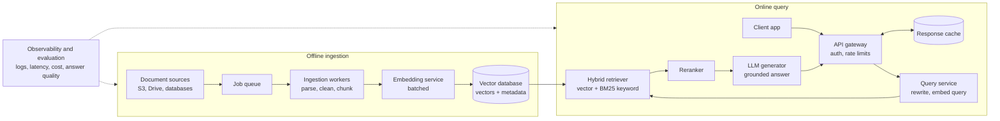

# RAG from Scratch

A Retrieval-Augmented Generation (RAG) pipeline built from scratch in Python. It answers questions about a custom set of PDF documents on how Large Language Models work, citing the sources it used, and it says so when the documents don't contain the answer.

The project implements every stage of RAG by hand (loading, cleaning, chunking, embedding, vector search, reranking, and generation) and compares three vector-store backends: a from-scratch numpy store, FAISS, and ChromaDB.

## Assignment criteria

| Acceptance criterion | Where it's covered |
|---|---|
| Builds a basic RAG pipeline from scratch in Python | [How it works](#how-it-works), `src/` |
| Explains the difference between ChromaDB and FAISS | [ChromaDB vs FAISS](#chromadb-vs-faiss) |
| Describes at least 2 chunking strategies and their trade-offs | [Chunking strategies](#chunking-strategies) |
| Draws a scalable RAG architecture with its components labeled | [Scalable architecture](#scalable-rag-architecture) |

## How it works

1. **Load**: read PDFs, `.txt`, and `.md` files from `data/`.
2. **Clean**: rejoin words hyphenated across line breaks, collapse whitespace, and drop the reference list at the end of academic papers.
3. **Chunk**: split each document into pieces of about 800 characters using one of two strategies, and drop fragments under 100 characters.
4. **Embed**: turn every chunk into a 384-dimensional vector with `BAAI/bge-small-en-v1.5`.
5. **Store and search**: index the vectors in numpy, FAISS, or ChromaDB and find the chunks closest to the question by cosine similarity.
6. **Rerank**: fetch the top 20 candidates, then re-score them with the cross-encoder `cross-encoder/ms-marco-MiniLM-L-6-v2` and keep the best 5.
7. **Generate**: send the question and the top 5 chunks to `llama3.2` (3B) running locally through Ollama. The prompt instructs the model to answer only from the context, cite chunk numbers, and admit when the answer is missing.

### Project structure

```
rag-from-scratch/
├── data/                # source documents
├── src/
│   ├── loader.py        # load and clean documents
│   ├── chunking.py      # fixed-size and recursive chunking
│   ├── embeddings.py    # BGE embedding model
│   ├── stores.py        # NumpyStore, FaissStore, ChromaStore
│   ├── rerank.py        # cross-encoder reranker
│   ├── rag.py           # pipeline: prepare, build store, retrieve
│   └── generate.py      # answer generation with Ollama
├── main.py              # interactive question answering
├── eval.py              # automated retrieval evaluation
└── requirements.txt
```

## Setup

Requires Python 3.11 or newer and [Ollama](https://ollama.com). Developed and tested on Windows.

```
git clone https://github.com/gullsnobar/rag-from-scratch.git
cd rag-from-scratch
python -m venv .venv
.venv\Scripts\Activate.ps1          # Windows PowerShell
# source .venv/bin/activate         # Linux / macOS
pip install -r requirements.txt
ollama pull llama3.2
```

The first run downloads the embedding model and the reranker (about 220 MB in total).

## Usage

Ask questions interactively:

```
python main.py [numpy|faiss|chroma] [recursive|fixed]
```

Both arguments are optional; the defaults are `numpy` and `recursive`.

Run the automated evaluation across every configuration:

```
python eval.py
```

### Example output

A question the documents can answer:

```
Ask a question (or 'quit'): What are the main stages of training an LLM?

The main stages of training an LLM are:
1. Pre-training: self-supervised learning on a large corpus to predict the next tokens...
2. Fine-tuning: training the pre-trained model on task-specific data...
3. Alignment-tuning: aligning the model with human preferences...

Sources:
  [1] llm.pdf-30
  [2] llm.pdf-29
  [3] llm.pdf-27
  [4] llm.pdf-67
  [5] LLM_Literacy_Lecture_March2026.pdf-4
```

A question the documents cannot answer:

```
Ask a question (or 'quit'): What is the capital of France?

I couldn't find that in the documents.
```

The model knows the capital of France, but it refused to answer from general knowledge because the retrieved context didn't contain it. That is the grounding behaviour RAG is meant to provide. The reranker also scored every candidate chunk around -11 for this question, far below the scores of relevant chunks, which shows the system can detect when it has no good match.

## Documents

Four PDFs about how LLMs work:

| File | Description |
|---|---|
| `llm.pdf` | A long academic survey of LLMs; the largest document by far |
| `How LLM works.pdf` | An explainer covering tokenization, the Transformer, and attention |
| `LLM_Literacy_Lecture_March2026.pdf` | Lecture slides on LLM training and impact |
| `LLM-Work.pdf` | A short document with little extractable text |

## Results

`eval.py` asks 9 questions whose answers appear in the documents and checks whether a chunk containing the expected answer appears in the top 5 results.

| Chunking | Store | Rerank | Hits (top 5) |
|---|---|---|---|
| fixed | numpy | no | 7/9 |
| fixed | numpy | yes | 7/9 |
| fixed | faiss | no | 7/9 |
| fixed | faiss | yes | 7/9 |
| fixed | chroma | no | 7/9 |
| fixed | chroma | yes | 7/9 |
| recursive | numpy | no | 5/9 |
| recursive | numpy | yes | **9/9** |
| recursive | faiss | no | 5/9 |
| recursive | faiss | yes | **9/9** |
| recursive | chroma | no | 5/9 |
| recursive | chroma | yes | **9/9** |

Key findings:

- **All three stores return identical results** in every configuration. They perform the same similarity calculation, which confirms the from-scratch numpy store is correct. The stores differ in storage, features, and scalability, not in retrieval quality.
- **Recursive chunking with reranking is the best configuration** and retrieved the answer for all 9 questions.
- **Without reranking, fixed-size chunking scored higher (7/9 vs 5/9).** Recursive chunking produces clean, self-contained introduction and overview paragraphs, and these look similar to almost any question about LLMs, so they pushed specific answers out of the top 5.
- **Reranking made no difference to fixed-size chunking.** A reranker can only reorder the candidates that search returns. When a fixed-size chunk cuts an answer in half, or the right chunk never reaches the top 20, there is nothing to promote. Chunking quality sets the ceiling; reranking helps reach it.

## Chunking strategies

Documents must be split into chunks because a whole document is too long to embed meaningfully or to send to an LLM, and smaller pieces make retrieval more precise. This project implements two strategies in `src/chunking.py`.

### 1. Fixed-size with overlap

Cut the text every 800 characters, with each chunk repeating the last 100 characters of the previous one.

- **Advantages**: simple, fast, and predictable; every chunk is the same size, which makes costs and context-window usage easy to estimate.
- **Disadvantages**: it ignores the text's structure, so chunks start and end mid-word or mid-sentence. In testing, a chunk began with "n process." and ended with "research pap". The overlap reduces this but duplicates text, which produced more chunks and more storage.

### 2. Recursive (structure-aware)

Split on paragraph breaks first. Any piece still over 800 characters is split on line breaks, then sentences, then words. Small pieces are merged back together up to the size limit.

- **Advantages**: chunks follow natural boundaries, so each one holds a complete idea. In testing, a recursive chunk kept an entire flowchart (Input Text → Tokenization → ... → Next Token) together. Coherent chunks are also easier for a reranker to judge, which is why this strategy reached 9/9 with reranking.
- **Disadvantages**: chunk sizes vary and the logic is more complex. Short fragments such as lone URLs or page numbers can become chunks of their own; these produced noisy embeddings and outranked real content until a minimum chunk size of 100 characters was added.

### Other strategies

- **Semantic chunking** embeds each sentence and starts a new chunk where the meaning shifts sharply. It produces the most coherent chunks but needs an embedding call per sentence, which is slow and costly for large collections.
- **Document-structure chunking** splits on headings in Markdown or HTML. It works very well for structured documentation but not for PDFs, where heading information is usually lost during extraction.

## ChromaDB vs FAISS

| | FAISS | ChromaDB |
|---|---|---|
| What it is | A similarity-search **library** from Meta | A full vector **database** |
| Stores | Vectors only | Vectors, document text, and metadata |
| Persistence | Manual: you save and load index files yourself | Automatic, to disk (`chroma_db/`) |
| Metadata filtering | Not built in | Built in (for example, filter by source file) |
| Index types | Many: Flat (exact), IVF, HNSW, Product Quantization | HNSW |
| Hardware | CPU and GPU | CPU |
| Deployment | Embedded in your Python process | Embedded, or as a client-server database |
| Best for | Maximum speed at very large scale, when you're willing to build the surrounding plumbing | Prototypes and small-to-medium apps where convenience matters |

The difference is visible in this project's code (`src/stores.py`):

- **`FaissStore`** keeps its own `self.chunks` list, because FAISS only returns integer positions in its index. The application has to map each position back to the chunk text and source file.
- **`ChromaStore`** stores the text and source alongside each vector, and every query returns them directly. Its data also survives after the program exits.

`IndexFlatIP` performs exact search, so FAISS matched the numpy store result for result. With millions of vectors, FAISS's approximate indexes (IVF, HNSW, PQ) trade a little accuracy for much faster search and lower memory use, which is where it outperforms a brute-force approach.

## Scalable RAG architecture

This project runs on a single machine and rebuilds its index on every start. A production system serving many users splits into an **offline ingestion pipeline** and an **online query path**.



### Components

**Offline ingestion**

- **Document sources**: where the knowledge lives, such as cloud storage, shared drives, wikis, and databases.
- **Job queue** (for example Redis, RabbitMQ, or SQS): holds a job for each new or changed document so work can be spread across workers and retried on failure.
- **Ingestion workers**: parse files, clean the text, and chunk it, running in parallel so thousands of documents can be processed at once.
- **Embedding service**: embeds chunks in batches, which keeps throughput high and cost low.
- **Vector database** (for example Qdrant, Weaviate, Milvus, Pinecone, or pgvector): stores vectors with metadata such as source, date, and access permissions, and uses approximate indexes to search millions of vectors in milliseconds.

**Online query**

- **Client app**: the chat interface or product feature where users ask questions.
- **API gateway**: handles authentication and rate limits, and checks a **response cache** so repeated questions don't trigger repeated LLM calls.
- **Query service**: optionally rewrites the question (for example, expanding follow-up questions using chat history), then embeds it.
- **Hybrid retriever**: combines vector search with BM25 keyword search. Keyword search catches exact terms, names, and numbers that embeddings can miss, which this project's evaluation showed are hard cases.
- **Reranker**: re-scores the top candidates with a cross-encoder. This project's results show why it matters: reranking raised recursive chunking from 5/9 to 9/9.
- **LLM generator**: writes the answer from the reranked context, with citations.

**Cross-cutting**

- **Observability and evaluation**: tracks latency, cost, and errors, and continuously measures retrieval and answer quality (for example with RAGAS or a test set like `eval.py`) so regressions are caught when documents, models, or prompts change.

## Limitations and future work

- **PDF extraction noise**: some words lose their spaces ("TheTransformeris") and page headers appear inside chunks. A layout-aware parser would produce cleaner text.
- **Document imbalance**: `llm.pdf` produces most of the chunks, so the smaller documents have fewer chances to be retrieved.
- **Citation formatting**: the 3B model sometimes lists all citations at the start of the answer instead of placing each one next to the fact it supports. A larger model would follow the citation instruction more closely.
- **No persistent index**: every run re-embeds all documents. Saving the vectors (or reusing the ChromaDB collection) would make startup instant.
- **Keyword search**: adding BM25 alongside vector search (hybrid retrieval) would help with exact names, numbers, and years.